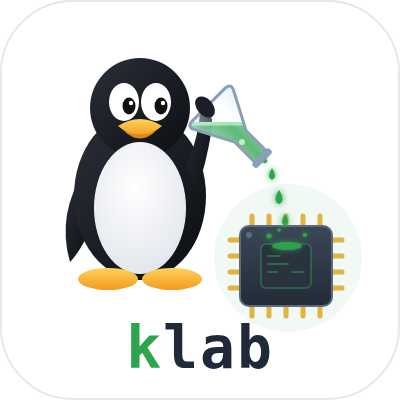
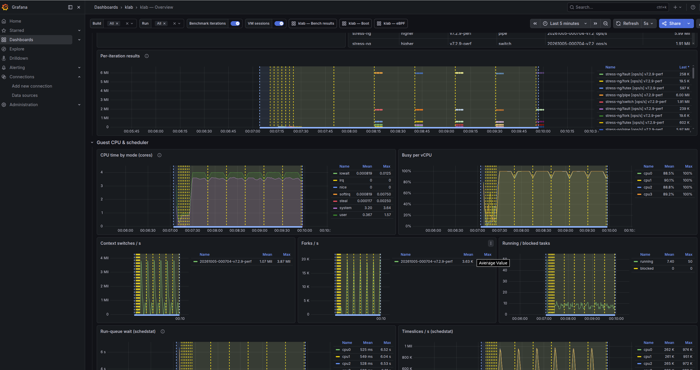
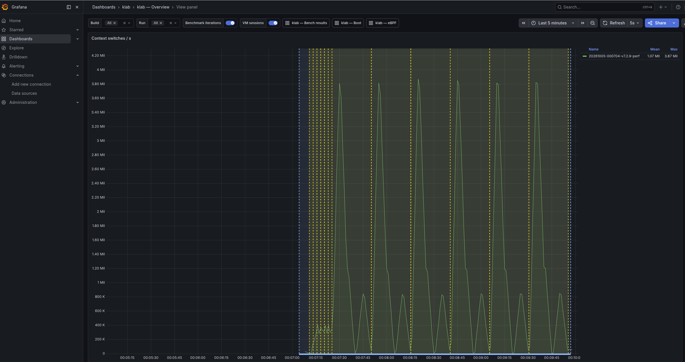

<p align="center">
  
</p>

<p align="center"><b>Linux kernel lab toolset</b></p>

<p align="center">
  <a href="https://github.com/amdrozdov/klab/actions/workflows/ci.yml">
    
  </a>
</p>

Fetch, build, boot and benchmark Linux kernels in QEMU, and compare builds.

## eBPF tracing

`make observe` turns on Grafana telemetry for every boot and benchmark — host and
guest metrics plus live eBPF probes on the running kernel (syscalls, scheduler,
block/ext4 latency, page cache). See [Observing](#observing-grafana-telemetry).

<p align="center">
  
  <br><sub>Overview dashboard</sub>
</p>

<p align="center">
  
  <br><sub>Context switches, traced with eBPF</sub>
</p>

The CLI is a uv project (stdlib only, Python >= 3.10). `./lab` is a shim for
`uv run lab` that works from any directory; `uv sync` creates `.venv` on first use.

```
uv sync                         # (once) set up .venv; or just run ./lab
./lab doctor                    # check host dependencies
make deps                       # (once) apt install what's missing
./lab rootfs                    # (once) Debian guest image via docker -> images/rootfs.ext4

make latest                     # = ./lab fetch stable && ./lab build
./lab boot                      # boot the last build; Ctrl-A X to quit
./lab bench run syscall hackbench

make observe                    # optional: Grafana telemetry for every run (see Observing)
```

Add `--dry` to any command (`./lab boot --dry`, `./lab --dry build -p debug`,
`make boot DRY=1`) to print the exact git / make / docker / qemu commands as a shell
script without running or changing anything.

## Layout

| Path | What |
|---|---|
| `lab`, `labtool/`, `pyproject.toml` | the CLI (uv project, stdlib only) |
| `configs/*.config` | kconfig fragments: `base` (always, incl. BTF), profiles `perf` / `debug` |
| `rootfs/` | Dockerfile + overlay for the guest image (autologin root, 9p mounts, job runner) |
| `benchmarks/<name>/bench.sh` | benchmarks that run inside the guest |
| `trees/` | kernel sources: shallow clones + git worktree variants |
| `builds/<name>/` | out-of-tree build dirs (`make O=`), with `lab-build.json` metadata |
| `runs/<id>/result.json` | benchmark results + metadata (commit, config hash, host, VM size) |
| `shared/` | mounted at `/mnt/lab` in interactive boots — drop files/modules here |
| `monitoring/` | telemetry stack: docker compose, scrape config, Grafana dashboards + generator |

`trees/ builds/ images/ runs/` are gitignored.

## Kernel versions and patches

```
./lab rtree                       # what's on kernel.org: series, latest, status, branch, local
./lab rtree 6.12                  # every release of one series (--rc adds release candidates)
./lab rtree 6                     # only 6.x series
./lab rtree --branches            # linux-X.Y.y, linux-rolling-*, master

./lab fetch                       # latest stable (kernel.org releases.json)
./lab fetch mainline              # latest -rc
./lab fetch 6.12.3                # specific version -> trees/v6.12.3
./lab fetch linux-6.12.y          # head of a branch -> trees/linux-6.12.y

./lab tree new myexp --from v6.12.3 --patch fix.patch   # variant as git worktree
./lab tree patch more.patch --tree myexp                # add patches later
./lab tree show myexp
```

Cleaning up (check names and sizes with `./lab ls` first; add `--dry` to preview):

```
./lab rm build v6.12.3-perf            # deletes builds/v6.12.3-perf
./lab rm tree myexp                    # variant: git worktree + its branch are removed
./lab rm tree v6.12.3                  # base clone: refused while variants still use it
./lab rm run 20261003-032052           # a benchmark/boottrace run (id, unique part, latest:<build>)
```

Start over completely with `./lab clean` (or `make clean`): it lists every lab-data path with
its size and asks `[y/N]` before deleting trees, builds, the rootfs image, runs, `.lab/`,
`shared/*` and monitoring targets. It only deletes what `.gitignore` marks as ignored (so
uncommitted sources are safe), never touches `experiments/` or `configs/`, keeps `.venv`,
refuses while a lab VM is running, and needs `--yes` when there is no terminal.
The observe stack's stored metrics live in docker volumes: `./lab observe down --wipe`.

Removing a tree does not remove its builds (it warns which builds still reference it).
Removing the current default (`*` in `lab ls`) clears it; pass names explicitly or run
`lab build <tree>` to set a new one.

Variants are ordinary git branches/worktrees: you can also just edit
`trees/myexp/` and commit. Patches can be `git format-patch` output (`git am`) or plain diffs.

## Builds

```
./lab build v6.12.3                    # -> builds/v6.12.3-perf
./lab build myexp -p debug             # -> builds/myexp-debug (DWARF, KASAN, lockdep, gdb scripts)
./lab build myexp --menuconfig
./lab diffconfig v6.12.3-perf myexp-perf
```

Config = `defconfig` + `kvm_guest.config` + `configs/base.config` + profile + `-f` fragments.
`base` includes BTF (needed by eBPF tools and the telemetry), so builds need `pahole`
(`sudo apt install dwarves`); debug info only affects the build, not the running kernel.
Options you asked for that kconfig dropped (unmet dependencies) are reported as warnings.
Modules are installed into `builds/<b>/modroot` and appear at `/lib/modules` in the guest.
`compile_commands.json` is generated and linked into the tree for clangd.

## Booting

```
./lab boot [build]                 # rootfs changes are discarded on exit
./lab boot --persist               # keep changes (e.g. apt install something)
./lab boot --cpus 8 --mem 8G --append "mitigations=off"
./lab boot myexp-debug --gdb       # paused; then in another terminal:
./lab gdb myexp-debug              #   gdb with vmlinux, lx-* helpers, target remote :1234
```

Leave the guest with `poweroff`, `halt` or `reboot` (all make qemu exit), or Ctrl-A X.
`halt` is mapped to power-off in the guest, since a real halt leaves qemu running.

The guest has perf, bpftrace, trace-cmd, strace, stress-ng, fio, sysbench, hackbench.
Network uses QEMU user mode (outbound only).

## Benchmarks

```
./lab bench list
./lab bench run syscall -b v6.12.3-perf -r 10 --boots 3 --pin 4-11
./lab runs
./lab show latest
./lab compare latest:v6.12.3-perf latest:myexp-perf
```

`compare` uses the first run as the baseline and marks a change only when it exceeds
2x the combined coefficient of variation (or `--threshold`).

Adding a benchmark: create `benchmarks/<name>/bench.sh` that prints
`METRIC <name> <value> <unit> <higher|lower>` lines. `*.c` files next to it are compiled
statically on the host. Header comments: `# description: ...`, `# iterations: 1`.

### Reducing noise

- Benchmark `perf` builds only, never `debug` (KASAN/lockdep).
- `sudo cpupower frequency-set -g performance`, disable turbo, keep the host idle.
- `--pin` qemu to dedicated host CPUs; same `--cpus/--mem` for every run you compare.
- Use more `--repeat` and `--boots`; look at `cv`.

## Observing (Grafana telemetry)

```
make observe                  # = ./lab observe up
./lab bench run hackbench     # unchanged; now also streams telemetry
open http://127.0.0.1:3000    # dashboards: folder "klab"
make observe-down             # stop (data kept); ./lab observe down --wipe deletes it
./lab observe status
```

`make observe` (re)builds the guest rootfs if it lacks the telemetry agents, then starts
the stack from `monitoring/docker-compose.yml`. All ports bind to 127.0.0.1 only.

| Service | Where | What |
|---|---|---|
| Grafana | http://127.0.0.1:3000 | dashboards, no login (local only) |
| VictoriaMetrics | http://127.0.0.1:8428/vmui | Prometheus-compatible storage + scraper, 90 days |
| Tempo | 127.0.0.1:3200 / OTLP 4318 | trace storage for `lab boottrace` waterfalls, 90 days |
| code-links | http://127.0.0.1:3001 | redirects trace source links to `vscode://file/...` |
| node-exporter | host | host CPU frequency, load, temperature |
| process-exporter | host | QEMU per-thread stats (vCPU threads named `CPU n/KVM`) |
| node-exporter | guest | guest kernel: CPU, schedstat, interrupts, softirqs, memory, PSI, ... |
| ebpf_exporter | guest | eBPF programs: syscalls, timers, softirq latency, block/ext4 latency, page cache, ... |

**While the stack is up, telemetry is on automatically** for `lab bench run` and `lab boot`:
lab forwards the guest's exporter ports, registers them as scrape targets (labels
`build`, `run`), marks every benchmark iteration as a Grafana annotation, and exports the
results. When the stack is down nothing changes: the guest agents only start when the
kernel is booted with `lab.telemetry=1`.

Dashboards (folder *klab*, pick builds/runs at the top):

- **Overview**: guest kernels and benchmark medians in range; guest CPU by mode,
  context switches, run-queue wait (schedstat), PSI, interrupts, softirqs, memory, page
  faults, disk/net; host CPU frequency/load and QEMU vCPU threads (host preemption = noise).
- **eBPF**: which ebpf_exporter configs attached on the selected kernel (and why not),
  then every metric: counters as rates, histograms as heatmap + p50/p90/p99 + events/s.
- **Bench results**: medians/stdev per run and every iteration over time.
- **Boot**: `lab boottrace` waterfalls and boot comparisons (see below).

Yellow regions are benchmark iterations, blue ones are VM sessions.

Notes:

- **Overhead.** eBPF probes cost time on every event they trace (e.g. `getpid` rises from
  ~68 ns to ~110 ns with the syscall counter attached). Use it to *understand* behaviour;
  compare final numbers with `--no-telemetry`. `lab compare` warns when mixing the two.
- **What attaches depends on the kernel.** The guest checks each config from
  `rootfs/overlay/etc/klab/ebpf-configs` and loads only the ones that work; the eBPF
  dashboard lists the others with the libbpf error (on 7.2: `oomkill`, `cfs-throttling`,
  `cgroup-rstat-flushing`, `unix-socket-backlog`). Network counters appear after the first
  event (e.g. only under network load).
- **No PMU on hybrid Intel hosts.** KVM gives guests no hardware perf counters on P/E-core
  CPUs (`/sys/module/kvm/parameters/enable_pmu` = N), so `llcstat` stays empty there.
- **BTF needed.** A build without BTF still boots with node metrics, but eBPF panels stay
  empty (lab warns); rebuild with `lab build`.
- **Changing dashboards.** Edit `monitoring/gen_dashboards.py` and run it (Grafana reloads
  the JSON). To add an eBPF config, list it in `rootfs/overlay/etc/klab/ebpf-configs`
  *and* `EBPF_CONFIGS`, then `make observe` (rebuilds the rootfs).
  `python3 monitoring/gen_dashboards.py --verify` lists live eBPF metrics without a panel.

## Boot process (`lab boottrace`)

```
make boottrace                       # = ./lab boottrace [build]
./lab boottrace v7.2.8-perf --boots 5 -l baseline
./lab compare latest:v7.2.8-perf ...  # boottrace runs are compare-able (pre-kernel/kernel/userspace)
./lab boottrace --resend             # re-upload saved traces Tempo is missing
```

Every trace is also saved as `runs/<id>/boot*/trace.otlp.json`. If the waterfall says *No data
found in response*, Tempo doesn't have that trace (e.g. it was down or still starting during
the boot): `lab boottrace --resend` uploads the missing ones; `make observe` does this
automatically and waits until Tempo is ready.

Boots the build with the kernel's initcall tracepoints on (`trace_event=initcall:*`,
near-zero cost), then collects the ftrace buffer, `dmesg` and systemd unit timestamps and
prints phases, kernel-log milestones, time per initcall level and the slowest initcalls and
units. With `make observe` running it also sends the boot to Grafana — **klab — Boot**:

```
boot <build>
├─ pre-kernel             QEMU start, firmware, kernel load + decompression (host-measured, approx.)
├─ kernel                 events on this span = kernel-log milestones
│  ├─ start_kernel        setup_arch, mm, sched, IRQs, timers (+ console initcalls)
│  ├─ initcalls: early    pre-SMP
│  ├─ SMP bring-up + driver core
│  ├─ initcalls: pure → core → postcore → arch → subsys → fs → device → late
│  │     └─ one span per initcall (µs exact)
│  └─ after initcalls     wait for async device probes → mount root → free init memory → exec init
└─ userspace (systemd)    one span per unit, activating → active
```

**Code walkthrough:** click any span → *Span attributes*: `link.vscode` opens the function at
its definition in your local tree (VS Code; via the `code-links` redirect on :3001, so
patched variants open their own source), `link.elixir` opens it on elixir.bootlin.com at the
tree's base tag, plus `code.filepath`/`code.lineno`. Initcalls are resolved from the
build's `vmlinux` debug info (`nm` + `addr2line`, cached in `builds/<b>/lab-sources.json`);
phase spans link to the function implementing them (`start_kernel`, `do_initcall_level`,
`wait_for_device_probe`, `prepare_namespace`, ...); systemd units get `link.docs` (man page).
Other editor: change the scheme in `monitoring/code-links/nginx.conf` (e.g. `cursor://file`).

The dashboard has the waterfall (Tempo) for the selected boot, phase times, slowest
initcalls, time per level, slowest units, and build comparisons (phases, levels and
every initcall ≥ 0.5 ms side by side).

Things to try:

- Read the code behind a span: `init/main.c` (`start_kernel`, `kernel_init`,
  `do_initcalls`), `include/linux/init.h` (initcall levels), `init/do_mounts.c` (root mount).
- On the default q35 machine ~0.4 s of the kernel phase is *waiting* in
  `wait_for_device_probe()` for async probes (AHCI scanning six empty SATA ports, the
  emulated DVD drive, PS/2 mouse). Disable `CONFIG_SATA_AHCI`/`CONFIG_ATA` in a variant
  (`lab build myexp --menuconfig`), boottrace both and compare.
- Initcall costs per subsystem: `pci_subsys_init` (PCI enumeration), `acpi_init` (ACPI
  namespace) dominate `subsys`; compare after trimming the config or with `--cpus 1`.
- Userspace: `systemd-binfmt` and `systemd-networkd` each take ~1 s in this rootfs.

## License

GPL-3.0, see [LICENSE](LICENSE). The logo is an original drawing of Tux, the Linux mascot
created by Larry Ewing (lewing@isc.tamu.edu) with The GIMP.
